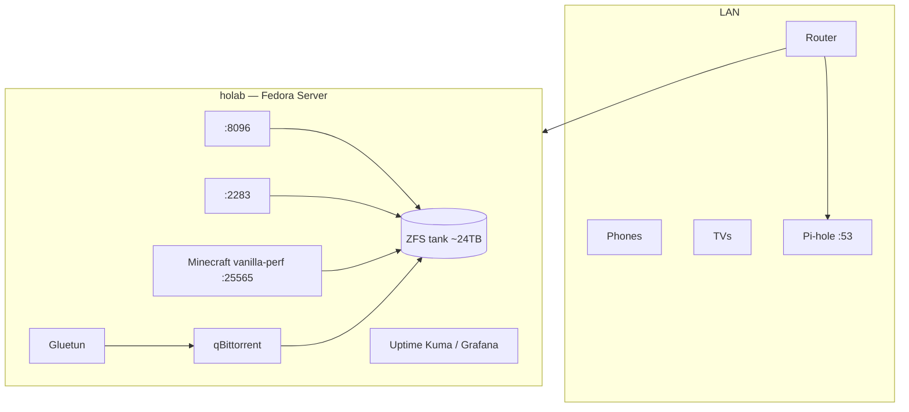

# ho-lab Architecture

Homelab on a single Fedora Server host (Ryzen 3700X, 32 GB RAM, 4×8 TB HDD).

See [docs/RESEARCH.md](docs/RESEARCH.md) for technology choices.

## Physical / logical



## Ansible structure (configuration-ansible pattern)

```
inventory.ini          → holab host in [homelab]
group_vars/homelab/      → services, images, minecraft_servers
host_vars/holab/         → timezone, LAN CIDR
holab_*_playbook.yml     → one file per stack at repo root
roles/                   → docker, jellyfin, minecraft, …
```

## Service matrix

| Service | Image | Port | Storage |
|---------|-------|------|---------|
| Jellyfin | `jellyfin/jellyfin:10.10.7` | 8096 | `/tank/media` or `/opt/ho-lab/data/media` |
| Immich | `immich-server:release` | 2283 | `/tank/photos` |
| Pi-hole | `pihole/pihole:2025.03.0` | 53, 8080 | `/opt/ho-lab/pihole` |
| qBittorrent | via Gluetun | 8080 | `/tank/downloads` |
| Monitoring | Prometheus/Grafana/Kuma | 3000–9090 | `/opt/ho-lab/*` |
| Minecraft | `itzg/minecraft-server:java21` | 25565 | `/tank/minecraft/vanilla-perf` |

## Deploy order

1. `holab_bootstrap_playbook.yml` — Docker on Fedora
2. `holab_storage_playbook.yml` — optional ZFS (destructive)
3. `holab_validate_playbook.yml` — vault + placeholders
4. `holab_site_playbook.yml` — all stacks (or run individual `holab_*` playbooks)

## On-server paths

```
/opt/ho-lab/
├── compose/          # rendered docker-compose trees
├── data/             # fallback before ZFS
└── pihole/ immich/ prometheus/ grafana/ uptime-kuma/

/tank/                # after holab_storage_playbook.yml
├── media/ photos/ downloads/ minecraft/ backups/
```

## Security

- Secrets in `group_vars/homelab/vault.yml` only
- Minecraft binds to `ansible_host` (LAN), not `0.0.0.0`
- qBittorrent traffic only through Gluetun
- No WAN exposure documented — use Tailscale for remote access
